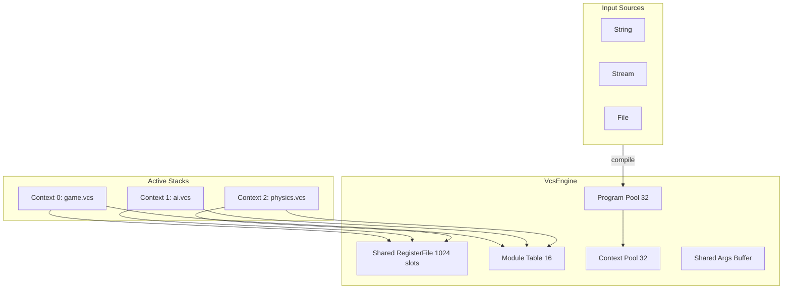

# VCS Pseudo-Code Interpreter Specification

## Requirements

- **Single file**: All pseudo-code in one portable file (`vcs.pseudo`)
- **Multi-stack**: Run multiple .vcs programs concurrently
- **Shared state**: All stacks share one RegisterFile for real-time variable updates
- **Flexible input**: Load from string, stream, or file
- **Zero allocation at runtime**: Fixed-size arrays, no GC
- **No reflection**: Static module table
- **Turing complete**: Jumps, conditionals, memory operations
- **Portable**: Easy translation to C, C++, Rust, C#, JS, Python

---

## Architecture



### Utility Theory Pattern

Multiple stacks share variables for real-time AI decision making:

```
Stack "ai_evaluate.vcs":        Stack "game_state.vcs":
  read $player_health            write $player_health
  read $enemy_distance           write $enemy_distance  
  write $best_action             read $best_action
```

---

## Single File Structure: `vcs.pseudo`

```
vcs.pseudo
├── SECTION 1: Constants & Config
├── SECTION 2: VcsValue (tagged union)
├── SECTION 3: VcsArgs (parameter buffer)
├── SECTION 4: Instruction
├── SECTION 5: VcsProgram
├── SECTION 6: RegisterFile (shared state)
├── SECTION 7: VcsContext (per-stack state)
├── SECTION 8: Module Interface
├── SECTION 9: LlmvccOps (core module)
├── SECTION 10: Compiler (string/stream parser)
├── SECTION 11: VcsEngine (multi-stack orchestrator)
└── SECTION 12: Example Usage
```

---

## Data Structures

### Constants

```pseudo
const MAX_REGISTERS   = 1024   // Shared variable slots
const MAX_STACK       = 256    // Per-context value stack
const MAX_PARAMS      = 8      // Parameters per instruction
const MAX_PROGRAMS    = 32     // Compiled program cache
const MAX_CONTEXTS    = 32     // Concurrent execution contexts
const MAX_MODULES     = 16     // Module table size
const MAX_INSTRUCTIONS = 4096  // Per-program instruction limit
```

### VcsValue (16-byte tagged union)

```pseudo
enum VType: u8 { NULL=0, INT=1, FLOAT=2, BOOL=3, STRING=4, SLOT=5 }

struct VcsValue:
    type:      VType           // 1 byte
    _pad:      u8[7]           // 7 bytes padding (alignment)
    union:                     // 8 bytes
        int_val:    i64        // INT, BOOL (0/1), SLOT (register index)
        float_val:  f64        // FLOAT
        string_id:  u32        // STRING (index into string table)

    // Factory methods (inline, no allocation)
    static Null()              -> VcsValue { type=NULL }
    static Int(v: i64)         -> VcsValue { type=INT, int_val=v }
    static Float(v: f64)       -> VcsValue { type=FLOAT, float_val=v }
    static Bool(v: bool)       -> VcsValue { type=BOOL, int_val=v?1:0 }
    static String(id: u32)     -> VcsValue { type=STRING, string_id=id }
    static Slot(idx: u16)      -> VcsValue { type=SLOT, int_val=idx }

    // Conversion (inline, no allocation)
    as_int()    -> i64   { return type==INT ? int_val : type==FLOAT ? (i64)float_val : 0 }
    as_float()  -> f64   { return type==FLOAT ? float_val : type==INT ? (f64)int_val : 0.0 }
    as_bool()   -> bool  { return int_val != 0 }
    is_slot()   -> bool  { return type == SLOT }
    slot_index() -> u16  { return (u16)int_val }
```

### VcsArgs (reusable parameter buffer)

```pseudo
struct VcsArgs:
    values: VcsValue[MAX_PARAMS]   // Fixed buffer
    count:  u8                      // Current parameter count

    clear()                        { count = 0 }
    add(v: VcsValue)               { if count < MAX_PARAMS: values[count++] = v }
    get(i: int) -> VcsValue        { return i < count ? values[i] : VcsValue.Null() }
    int(i: int, def: i64 = 0)      -> i64  { return i < count ? values[i].as_int() : def }
    float(i: int, def: f64 = 0.0)  -> f64  { return i < count ? values[i].as_float() : def }
    bool(i: int, def: bool = false) -> bool { return i < count ? values[i].as_bool() : def }
```

### Instruction (8 bytes, cache-friendly)

```pseudo
struct Instruction:
    module_id:   u8                // Index into module table (0-15)
    method_id:   u8                // Opcode within module (0-255)
    param_count: u8                // Number of parameters (0-8)
    flags:       u8                // Reserved for future use
    params_offset: u32             // Offset into program's param pool

// Parameters stored separately for cache efficiency:
// Instructions are read sequentially, params only when needed
```

### VcsProgram (compiled bytecode)

```pseudo
struct VcsProgram:
    id:           u16                           // Unique program ID
    name:         char[32]                      // Debug name
    instructions: Instruction[MAX_INSTRUCTIONS] // Instruction array
    inst_count:   u16                           // Number of instructions
    params:       VcsValue[MAX_INSTRUCTIONS*4]  // Parameter pool
    param_count:  u16                           // Total parameters
    in_use:       bool                          // Slot occupied flag

    get_params(inst: Instruction) -> VcsValue*:
        return &params[inst.params_offset]
```

### RegisterFile (shared across all contexts)

```pseudo
struct RegisterFile:
    slots:        VcsValue[MAX_REGISTERS]      // Value storage
    names:        char[MAX_REGISTERS][32]      // Variable names (compile-time)
    name_to_slot: HashMap<string, u16>         // Compile-time lookup only
    next_slot:    u16 = 0                      // Next available slot
    lock:         SpinLock                     // Optional: for multi-threaded

    // Runtime access (O(1), lock-free for single-thread)
    get(slot: u16) -> VcsValue:
        return slots[slot]

    set(slot: u16, val: VcsValue):
        slots[slot] = val

    // Compile-time only (may allocate)
    allocate(name: string) -> u16:
        if name_to_slot.contains(name):
            return name_to_slot[name]
        slot = next_slot++
        names[slot] = name
        name_to_slot[name] = slot
        return slot

    get_slot(name: string) -> i32:
        return name_to_slot.get(name, -1)
```

### VcsContext (per-stack execution state)

```pseudo
struct VcsContext:
    id:          u16                    // Context ID
    program_id:  u16                    // Which program is loaded
    ip:          u16                    // Instruction pointer
    stack_top:   u8                     // Stack pointer
    state:       enum { IDLE, RUNNING, PAUSED, STOPPED }
    stack:       VcsValue[MAX_STACK]    // Local value stack
    args:        VcsArgs                // Per-context argument buffer
    print_fn:    fn(string)             // Output callback (optional)
    
    // Stack operations (inline, bounds-checked)
    push(v: VcsValue):
        if stack_top < MAX_STACK: stack[stack_top++] = v

    pop() -> VcsValue:
        return stack_top > 0 ? stack[--stack_top] : VcsValue.Null()

    peek() -> VcsValue:
        return stack_top > 0 ? stack[stack_top-1] : VcsValue.Null()

    reset():
        ip = 0; stack_top = 0; state = IDLE
```

---

## Module System

### Module Interface

```pseudo
interface IModule:
    eval(method_id: u8, args: VcsArgs*, ctx: VcsContext*, regs: RegisterFile*) -> VcsValue
```

### LlmvccOps (Module 0) - Core Operations

```pseudo
module LlmvccOps implements IModule:

    eval(id: u8, args: VcsArgs*, ctx: VcsContext*, regs: RegisterFile*) -> VcsValue:
        switch id:
            // === Control Flow ===
            case 0:  return nop()
            case 1:  return stop(ctx)
            case 2:  return error(args)
            case 3:  return skip(args, ctx)
            case 4:  return jump(args, ctx)
            case 5:  return jump_if(args, ctx)
            case 6:  return jump_if_not(args, ctx)

            // === Stack ===
            case 7:  return push(args, ctx)
            case 8:  return pop(ctx)
            case 9:  return dup(ctx)
            case 10: return swap(ctx)

            // === Variables (shared state) ===
            case 11: return store(args, regs)
            case 12: return load(args, ctx, regs)
            case 13: return print(args, ctx)

            // === Math ===
            case 14: return mod(args)
            case 15: return mul(args)
            case 16: return div(args)
            case 17: return add(args)
            case 18: return sub(args)
            case 19: return pow(args)

            // === Compare ===
            case 20: return eq(args)
            case 21: return neq(args)
            case 22: return gt(args)
            case 23: return lt(args)
            case 24: return gte(args)
            case 25: return lte(args)

            // === Logic ===
            case 26: return and(args)
            case 27: return or(args)
            case 28: return not(args)
            case 29: return xor(args)

            default: return VcsValue.Null()

    // Implementation examples:
    stop(ctx): ctx.state = STOPPED; return VcsValue.Null()
    jump(args, ctx): ctx.ip = args.int(0) - 1; return VcsValue.Int(ctx.ip)
    jump_if(args, ctx): if args.bool(1): ctx.ip = args.int(0) - 1; return args.get(1)
    store(args, regs): slot = args.int(0); regs.set(slot, args.get(1)); return args.get(1)
    load(args, ctx, regs): slot = args.int(0); v = regs.get(slot); ctx.push(v); return v
    add(args): return VcsValue.Float(args.float(0) + args.float(1))
    lt(args): return VcsValue.Bool(args.float(0) < args.float(1))
```

---

## Compiler (String/Stream Input)

```pseudo
struct VcsCompiler:
    registers: RegisterFile*    // Shared register file

    // Compile from string
    compile_string(source: string, program: VcsProgram*) -> bool:
        return compile_lines(source.split('\n'), program)

    // Compile from stream (line-by-line, no full load)
    compile_stream(stream: InputStream, program: VcsProgram*) -> bool:
        lines = []
        while line = stream.read_line():
            lines.append(line)
        return compile_lines(lines, program)

    // Core compilation
    compile_lines(lines: string[], program: VcsProgram*) -> bool:
        program.inst_count = 0
        program.param_count = 0

        for line in lines:
            line = trim(line)
            if line.empty() or line.starts_with("//"):
                continue

            inst = parse_instruction(line, program)
            if inst.module_id == 255:  // Parse error
                return false
            program.instructions[program.inst_count++] = inst

        program.in_use = true
        return true

    parse_instruction(line: string, program: VcsProgram*) -> Instruction:
        // Parse "moduleId.methodId(param1, param2, ...)"
        dot = line.index_of('.')
        paren = line.index_of('(')
        close = line.last_index_of(')')

        module_id = parse_int(line[0:dot])
        method_id = parse_int(line[dot+1:paren])
        params_str = line[paren+1:close]

        inst = Instruction {
            module_id, method_id,
            param_count: 0,
            params_offset: program.param_count
        }

        // Parse parameters
        for param in split_params(params_str):
            val = parse_value(param)
            program.params[program.param_count++] = val
            inst.param_count++

        return inst

    parse_value(token: string) -> VcsValue:
        token = trim(token)
        
        // Variable reference: $varName
        if token.starts_with("$"):
            name = token[1:]
            slot = registers.allocate(name)
            return VcsValue.Slot(slot)

        // Quoted string: "text" or 'text'
        if token.starts_with('"') or token.starts_with("'"):
            // Store in string table, return ID
            return VcsValue.String(intern_string(token[1:-1]))

        // Boolean
        if token == "true": return VcsValue.Bool(true)
        if token == "false": return VcsValue.Bool(false)

        // Number
        if token.contains('.'):
            return VcsValue.Float(parse_float(token))
        else:
            return VcsValue.Int(parse_int(token))
```

---

## VcsEngine (Multi-Stack Orchestrator)

```pseudo
struct VcsEngine:
    registers:  RegisterFile                    // Shared state
    modules:    IModule*[MAX_MODULES]           // Static module table
    programs:   VcsProgram[MAX_PROGRAMS]        // Compiled program cache
    contexts:   VcsContext[MAX_CONTEXTS]        // Execution context pool
    compiler:   VcsCompiler                     // Shared compiler

    // Initialize engine
    init():
        registers = RegisterFile{}
        compiler.registers = &registers
        
        // Static module registration (no reflection)
        modules[0] = &LlmvccOps{}
        modules[1] = &GraphicsOps{}   // Optional
        modules[2] = &SortingOps{}    // Optional
        // ... add more as needed

        // Initialize pools
        for i in 0..MAX_PROGRAMS: programs[i].in_use = false
        for i in 0..MAX_CONTEXTS: contexts[i].state = IDLE

    // === Program Loading ===

    // Load from string, return program ID
    load_string(source: string, name: string = "program") -> i32:
        slot = find_free_program_slot()
        if slot < 0: return -1
        
        programs[slot].id = slot
        programs[slot].name = name
        if not compiler.compile_string(source, &programs[slot]):
            return -1
        return slot

    // Load from stream
    load_stream(stream: InputStream, name: string = "stream") -> i32:
        slot = find_free_program_slot()
        if slot < 0: return -1

        programs[slot].id = slot
        programs[slot].name = name
        if not compiler.compile_stream(stream, &programs[slot]):
            return -1
        return slot

    // === Context Management ===

    // Create execution context for a program
    create_context(program_id: u16) -> i32:
        slot = find_free_context_slot()
        if slot < 0: return -1

        contexts[slot].id = slot
        contexts[slot].program_id = program_id
        contexts[slot].reset()
        return slot

    // Start context execution
    start(ctx_id: u16):
        contexts[ctx_id].state = RUNNING

    // Pause context
    pause(ctx_id: u16):
        contexts[ctx_id].state = PAUSED

    // Stop context
    stop(ctx_id: u16):
        contexts[ctx_id].state = STOPPED

    // === Execution ===

    // Step single context by N instructions
    step(ctx_id: u16, count: u16 = 1) -> u16:
        ctx = &contexts[ctx_id]
        if ctx.state != RUNNING: return 0

        program = &programs[ctx.program_id]
        executed = 0

        while executed < count and ctx.state == RUNNING and ctx.ip < program.inst_count:
            inst = program.instructions[ctx.ip]
            params = program.get_params(inst)

            // Resolve parameters (SLOT -> actual value)
            ctx.args.clear()
            for i in 0..inst.param_count:
                p = params[i]
                if p.is_slot():
                    ctx.args.add(registers.get(p.slot_index()))
                else:
                    ctx.args.add(p)

            // Dispatch to module
            module = modules[inst.module_id]
            result = module.eval(inst.method_id, &ctx.args, ctx, &registers)

            ctx.ip++
            executed++

        if ctx.ip >= program.inst_count:
            ctx.state = STOPPED

        return executed

    // Step ALL running contexts by N instructions each (round-robin)
    step_all(count: u16 = 1):
        for i in 0..MAX_CONTEXTS:
            if contexts[i].state == RUNNING:
                step(i, count)

    // Run single context to completion
    run(ctx_id: u16):
        while contexts[ctx_id].state == RUNNING:
            step(ctx_id, 100)

    // === Variable Access (for external code) ===

    get_var(name: string) -> VcsValue:
        slot = registers.get_slot(name)
        return slot >= 0 ? registers.get(slot) : VcsValue.Null()

    set_var(name: string, val: VcsValue):
        slot = registers.get_slot(name)
        if slot >= 0: registers.set(slot, val)

    // === Helpers ===

    find_free_program_slot() -> i32:
        for i in 0..MAX_PROGRAMS:
            if not programs[i].in_use: return i
        return -1

    find_free_context_slot() -> i32:
        for i in 0..MAX_CONTEXTS:
            if contexts[i].state == IDLE or contexts[i].state == STOPPED:
                return i
        return -1
```

---

## Example Usage

### Single Stack Execution

```pseudo
engine = VcsEngine{}
engine.init()

source = """
0.11("counter", 0)       // store counter = 0
0.17($counter, 1)        // add counter + 1
0.11("counter", $result) // store result
0.23($counter, 10)       // compare counter < 10
0.5(1, $result)          // jump to line 1 if true
0.13($counter)           // print counter
0.1()                    // stop
"""

prog_id = engine.load_string(source, "counter")
ctx_id = engine.create_context(prog_id)
engine.start(ctx_id)
engine.run(ctx_id)

print(engine.get_var("counter"))  // Output: 10
```

### Multi-Stack with Shared Variables (Utility Theory)

```pseudo
engine = VcsEngine{}
engine.init()

// Game state stack - updates world variables
game_src = """
0.11("player_hp", 100)
0.11("enemy_dist", 50)
// ... game loop updates these
"""

// AI evaluation stack - reads state, writes decisions
ai_src = """
0.12("player_hp")        // load player_hp to stack
0.23($player_hp, 30)     // is hp < 30?
0.5(5, $result)          // if true, jump to heal
0.11("action", 1)        // action = ATTACK
0.4(7)                   // jump to end
0.11("action", 2)        // action = HEAL
// end
0.1()
"""

// Load both programs
game_prog = engine.load_string(game_src, "game_state")
ai_prog = engine.load_string(ai_src, "ai_eval")

// Create contexts
game_ctx = engine.create_context(game_prog)
ai_ctx = engine.create_context(ai_prog)

// Run interleaved
engine.start(game_ctx)
engine.start(ai_ctx)

// Game loop - both stacks share 'player_hp', 'enemy_dist', 'action'
while game_running:
    engine.step_all(10)  // Each stack executes 10 instructions
    
    // External code can also read/write
    action = engine.get_var("action").as_int()
    if action == 2:
        engine.set_var("player_hp", VcsValue.Int(100))
```

---

## Memory Layout (Cache Optimized)

```
VcsEngine (total ~2.5 MB pre-allocated):
├── RegisterFile:        16 KB  (1024 * 16 bytes)
├── Modules:             128 B  (16 * 8 byte pointers)
├── Programs[32]:        ~2 MB  (32 * 64KB each)
│   └── Each Program:
│       ├── Instructions: 32 KB (4096 * 8 bytes)
│       └── Params:       ~32 KB (4096 * 4 * 16 bytes, typical)
└── Contexts[32]:        ~270 KB (32 * 8.5KB each)
    └── Each Context:
        ├── Stack:        4 KB  (256 * 16 bytes)
        └── Args:         144 B (8 * 16 + 8 bytes)
```

---

## Porting Guide

Translate `vcs.pseudo` to target language:

- **C**: Use `union` for VcsValue, function pointers for modules
- **C++**: Use `std::variant` or manual union, virtual interfaces
- **Rust**: Use `enum` for VcsValue, traits for Module
- **C#**: Use `struct` with `[StructLayout]`, interfaces
- **JavaScript**: Use TypedArrays for performance, classes for structure
- **Python**: Use `@dataclass`, NumPy arrays for bulk operations